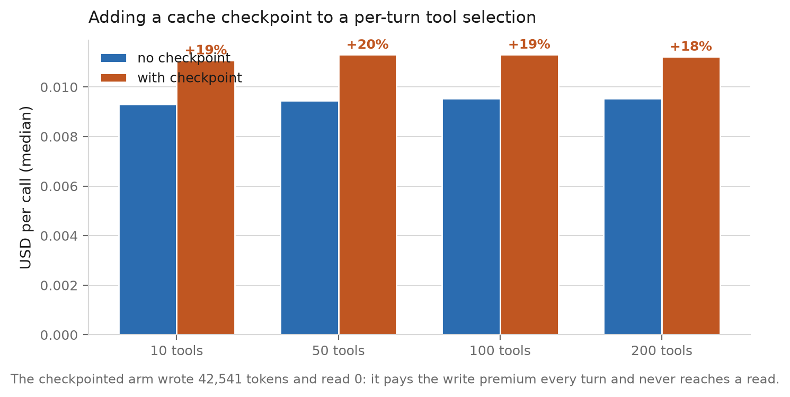
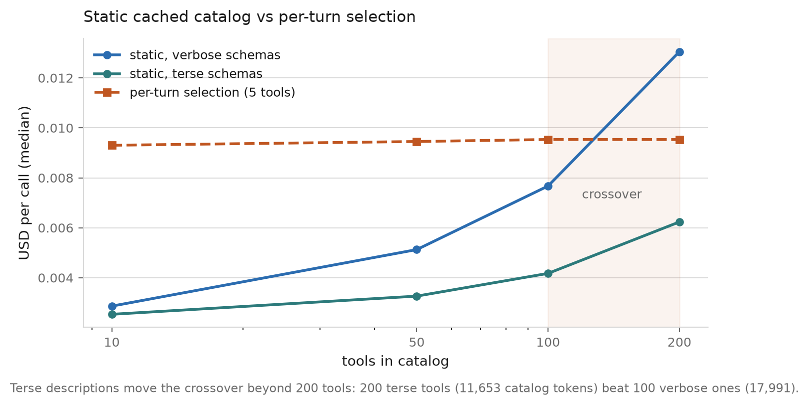
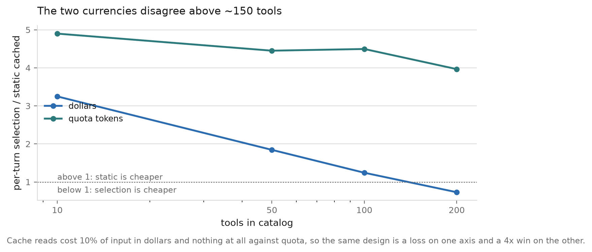
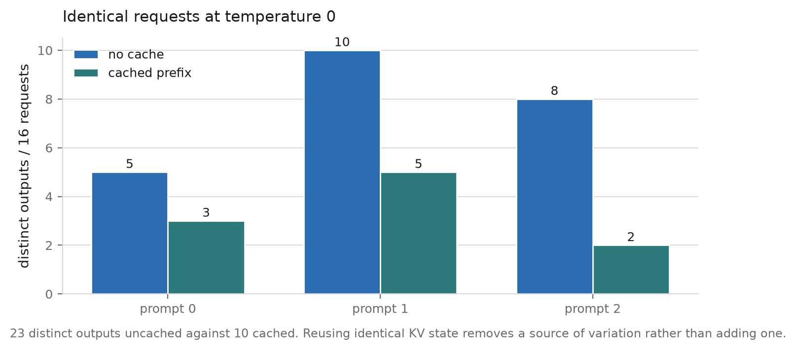

# Two Currencies: Prompt Caching, Tool Catalogs and the Cost of Agentic Inference on Amazon Bedrock

**Brian Feeny**

*26 September 2026. Independent work. I work at Amazon Web Services; the views and
assessments here are my own.*

---

## Abstract

Advice on reducing the cost of LLM inference is usually advice on reducing token
counts. On Amazon Bedrock that is the wrong objective, for two reasons we
measure directly. First, a request spends in two currencies that are not
proportional: dollars, and a tokens-per-minute quota in which output tokens
burn at five to fifteen times their billed weight while cache reads burn at
nothing. Second, in an agentic loop the great majority of what the model ingests
is context it has already seen, so realized cost is governed less by how many
tokens are sent than by whether the prefix carrying them is still cacheable.
We show that these two facts make a widely recommended practice actively
harmful. AWS advises narrowing the tool set presented to a model on each
request, and separately documents prompt caching whose checkpoints chain
`tools` → `system` → `messages`, so that changing the tool set invalidates
everything after it. Applied together on Claude Sonnet 4.5, the combination
costs 18–20% more than tool-narrowing alone and, for catalogs up to 100 tools,
more than either practice applied by itself; the checkpointed arm wrote 42,541
cache tokens and read zero. A static cached catalog is 3.25× cheaper than
per-turn selection at 10 tools and loses at 200, placing the crossover between
100 and 200 — but re-running with terse tool descriptions moves it beyond 200,
and 200 terse tools (11,653 catalog tokens) beat 100 verbose ones (17,991). The
governing variable is catalog size in tokens, not the number of tools, which is
what the published guidance names. Measured in quota rather than dollars the
static catalog wins at every size, still by 4.0× at 200 tools, so the two
currencies recommend opposite architectures at the top of the range. Separately,
we find that prompt caching makes output *more* deterministic, not less: across
16 identical requests at temperature 0, the uncached arm produced 23 distinct
completions against the cached arm's 10. We release the harness, the raw runs,
and three cache-isolation requirements that benchmarks in this area appear not
to observe.

---

## 1. Introduction

The literature on reducing LLM cost is large, and almost all of it optimizes a
single quantity: the number of tokens in the prompt. Compression methods remove
tokens; retrieval curation sends fewer of them; few-shot reduction deletes
exemplars. The implicit model is that cost is proportional to token count, so
reducing the count reduces the cost.

On a managed inference platform that model is wrong in two specific ways, and
both are measurable.

The first is that there are two currencies. Amazon Bedrock bills per token, and
separately meters a tokens-per-minute quota that throttles admission. The two
are computed differently — output tokens count once in dollars and five to
fifteen times against quota depending on the model, while tokens read from a
prompt cache cost a tenth in dollars and nothing at all against quota. A
technique can therefore improve one and worsen the other, and we exhibit a case
where they recommend opposite architectures.

The second is that in an agentic loop most tokens are not new. Published
workload characterization finds input-to-output ratios in the range 54–560×
while the *newly appended* content per step is only 1.5–7.3× the output [6],
implying that roughly 97–99% of what the model ingests at each step is context
it has already seen. Where a prompt cache is working, those tokens are billed at
the cache-read rate. Realized cost is then governed by cache *hit rate*, not by
token count — and the techniques that reduce token count frequently do so by
changing the prefix, which is exactly what destroys the hit rate.

These two observations meet in a concrete piece of AWS guidance. The
Well-Architected agentic-AI lens advises narrowing the tool set presented on
each request, on the grounds that models choose poorly from large candidate sets
[3]. Bedrock AgentCore Gateway ships a semantic tool-search capability to do it
[4]. Separately, Bedrock documents prompt caching, and states that cache
checkpoints are processed in the order `tools` → `system` → `messages`, and that
"changing content in an earlier section invalidates the cache for later
sections" [1]. Both recommendations are sound in isolation. Together, the tool
set becomes the most volatile part of the most cache-sensitive position in the
prompt.

We measure what that costs. Our contributions:

1. A cost model that separates the two currencies, and a closed form for how
   many cache reads a checkpoint needs before it repays its own write
   (Section 2).
2. A measurement of the combination penalty: applying both recommendations
   together costs 18–20% more than tool-narrowing alone, and for catalogs up to
   100 tools more than either alone (Section 4.1).
3. The location of the static-versus-dynamic crossover, and evidence that it
   tracks catalog size in tokens rather than tool count — the variable the
   guidance names (Section 4.2).
4. A demonstration that the two currencies disagree at the top of the range,
   with the static catalog losing on dollars and winning 4.0× on quota
   (Section 4.3).
5. A determinism result running opposite to the self-hosted literature: caching
   reduces output variation on a hosted endpoint (Section 5).
6. Three cache-isolation requirements, each of which produced a plausible wrong
   answer in our own work before being caught (Section 3.3).

---

## 2. Cost model

### 2.1 Two currencies

A single Converse call reports four token counts: input $I$, output $O$, cache
read $R$ and cache write $W$. Bedrock reports them separately because they are
priced separately; we never aggregate them.

Let $p$ and $q$ be the per-token input and output prices, $\mu_w$ the cache-write
multiplier on the input rate, $\mu_r$ the cache-read multiplier, and $\tau$ the
service-tier multiplier. The dollar cost of a call is

$$
C \;=\; \tau\,\Bigl[\, p\,\bigl(I + \mu_w W + \mu_r R\bigr) \;+\; q\,O \,\Bigr].
$$

Quota consumption is a different function of the same counts. Writing $\beta$ for
the model's output burndown rate,

$$
Q \;=\; I \;+\; W \;+\; \beta\,O ,
$$

with cache reads absent entirely [2]. For the Anthropic models we measure,
$\beta = 5$; it reaches 15 on Claude 4.8 and 10 on the Claude 5 family. AWS's own
worked example is a 1,000-token input with 100 output tokens, which bills 1,100
tokens and consumes 1,500 of quota — a 36% divergence from one call.

Two consequences follow. An output token can cost as much as fifteen input
tokens of admission capacity, so techniques that trade input length for output
length are worse than their token counts suggest. And because $R$ appears in $C$
at $\mu_r$ but is absent from $Q$ altogether, a cached prefix is *free* in quota
terms, which makes caching a throughput lever at least as much as a cost one.

### 2.2 When a checkpoint repays its write

Writing a checkpoint costs $(\mu_w - 1)p$ more than sending the same tokens
uncached; each subsequent read saves $(1 - \mu_r)p$. A checkpoint therefore
breaks even after

$$
n^\star \;=\; \frac{\mu_w - 1}{1 - \mu_r}
$$

reads. From the published per-model table [5], $\mu_w = 1.25$ for a five-minute
entry and $2.00$ for a one-hour entry, with $\mu_r = 0.10$ throughout (Claude
Opus 5.5 is the exception at $\mu_r = 0.05$). Hence

$$
n^\star_{5\text{m}} = 0.28, \qquad n^\star_{1\text{h}} = 1.11 .
$$

A five-minute cache is ahead after a single read; a one-hour cache after
slightly more than one. The question "is caching worth it?" therefore answers
itself in the affirmative almost always, and the operative question becomes
whether the architecture permits the prefix to survive long enough to be read at
all. That is the subject of Section 4.

### 2.3 The invalidation chain

Bedrock processes checkpoints in the order `tools`, `system`, `messages`, and
changing an earlier section invalidates the cache for later ones [1]. Let $T$ be
the token length of the tool block and $S$ the system prompt. For a session of
$k$ turns in which the tool block is constant, the prefix is written once and
read $k-1$ times, giving an amortized per-turn prefix cost of

$$
\frac{\mu_w + (k-1)\,\mu_r}{k}\,(T + S)\,p .
$$

If instead the tool block is re-selected each turn, no read is ever reached and
the per-turn cost is $\mu_w (T' + S) p$ for the smaller selected block $T'$. The
second is cheaper only when

$$
\mu_w (T' + S) \;<\; \frac{\mu_w + (k-1)\mu_r}{k}\,(T + S),
$$

which for $k \gg 1$ approaches $\mu_w (T' + S) < \mu_r (T+S)$ — that is, the
selected block must be smaller than the full catalog by more than the ratio
$\mu_w/\mu_r = 12.5$. Selecting 5 tools from 10 does not clear that bar; from
200 it does. This is the crossover we locate empirically in Section 4.2, and the
inequality makes explicit that it is governed by token lengths $T$ and $T'$,
not by tool counts.

---

## 3. Method

### 3.1 Harness

All measurements run against Bedrock Converse in `us-east-1` on Claude Sonnet
4.5 (`us.anthropic.claude-sonnet-4-5-20250929-v1:0`), through a harness that
records, per call, the four token counts, both currencies, latency, `stopReason`,
and whether a cache checkpoint demonstrably engaged. Rows are appended to JSONL;
analysis never re-runs inference. Prices are carried per model with their
provenance, and any model whose rate we have not verified from a primary source
yields a token ledger with the dollar column omitted rather than estimated.

Four rules are enforced in code rather than by discipline:

1. **Both currencies, always.** Every result reports dollars and burndown-weighted
   quota separately.
2. **Never blend the four token counts.**
3. **Assert that the mechanism engaged.** A checkpoint below the model's minimum
   cacheable prefix is ignored, and the request still succeeds — silently.
4. **Distributions, not means.** Run-to-run token spend on identical agentic
   tasks has been measured varying by up to 30× [7]; we report medians and
   paired bootstrap intervals.

### 3.2 Silent failure of the mechanism

Rule 3 is not hypothetical. An identical 3,935-token prefix cached on Sonnet 4.5,
whose minimum is 1,024 tokens, and was silently ignored by Haiku 4.5, whose
minimum is 4,096 — the same code, no error, and the full input billed. Minimums
vary from 512 to 4,096 across current Anthropic models and are not monotone in
model size. The harness therefore sizes prefixes from each model's own minimum
and treats an arm that expected caching and never observed a read or a write as
a failed run rather than a null result.

### 3.3 Three isolation requirements

Benchmarking prompt caching requires three isolations that we have not seen
documented. Each produced a plausible wrong answer in our own work.

**Arm isolation.** Our first version of Experiment 1 gave the dynamic arm no
checkpoint at all, comparing a cached static catalog against an *uncached*
dynamic one. That conflates two variables — whether the tool set varies, and
whether a checkpoint was present — and the arm that tests the actual claim
(varying tools *with* a checkpoint) was absent.

**Seed isolation.** With an identical prefix across repetitions, the first seed
writes the cache and later seeds read it, so every arm appears to amortize. A
related failure: selecting 5 tools from a catalog of 10 with an offset formula
that wrapped modulo 5 produced the same 5 tools every turn, silently converting
the dynamic arm into a static one. We now derive the prefix per seed and refuse
a subset too large to vary.

**Run isolation.** Cache entries outlive the process for the duration of the TTL,
so a benchmark re-run within five minutes reads what the previous run wrote. This
surfaced as an arm reporting **zero writes and 42,199 reads**, which is
impossible in isolation. The diagnostic is simple and we recommend it generally:
*any arm that reads without ever writing is not isolated.*

### 3.4 Workload

The system prefix is deterministic, non-repetitive technical filler sized to
clear the model's minimum; repetitive filler tokenizes unlike real context and
would flatter any caching result. Tool catalogs are synthesized with tool *count*
and schema *verbosity* as independent parameters, because the two are routinely
conflated and Section 4.2 turns on separating them.

One workload note with general application. An earlier version of Experiment 2
asked the model to summarize risks in a procedural document; 32 of 96
generations returned `stop_reason: content_filtered` with empty bodies. Empty
strings compare equal to one another, so a filtered cell reads as *perfect
determinism*. We report this because any experiment that compares model outputs
must inspect `stopReason` before comparing them: a filtered response is an empty
result, not a short one.

---

## 4. Experiment 1: tool catalogs and the cacheable prefix

Three arms over a six-turn session, three seeds, catalogs of 10, 50, 100 and 200
tools:

- **static** — the full catalog, with a checkpoint after `tools` + `system`.
- **dynamic+cache** — a five-tool subset selected per turn, *with* a checkpoint.
  This is what following both AWS recommendations produces.
- **dynamic** — the same varying subset, no checkpoint. The control.

### 4.1 The combination penalty

*Figure 1. Adding a cache checkpoint to a per-turn tool selection, by catalog
size. Median USD per call.*

| catalog | dynamic+cache | dynamic | penalty |
|---|---|---|---|
| 10 | 0.011080 | 0.009303 | **+19%** |
| 50 | 0.011305 | 0.009453 | **+20%** |
| 100 | 0.011312 | 0.009534 | **+19%** |
| 200 | 0.011227 | 0.009531 | **+18%** |

Turning caching *on* is worse than leaving it off, at every catalog size. The
mechanism is visible in the raw counts: at catalogs of 50, 100 and 200 the
checkpointed arm wrote 42,541 tokens and read exactly zero. Every turn pays the
$\mu_w = 1.25$ write premium and none reaches a read, so by the break-even of
Section 2.2 the arm never approaches $n^\star$.

Comparing against both individual recommendations:

| catalog | caching only | **both** | narrowing only | |
|---|---|---|---|---|
| 10 | 0.002864 | **0.011080** | 0.009303 | worse than either alone |
| 50 | 0.005127 | **0.011305** | 0.009453 | worse than either alone |
| 100 | 0.007673 | **0.011312** | 0.009534 | worse than either alone |
| 200 | 0.013049 | **0.011227** | 0.009531 | worse than narrowing alone |

Up to 100 tools, combining the two recommendations is worse than applying either
one by itself. At 200 the combination still loses to tool-narrowing alone but
beats caching alone, because caching a catalog that large has itself become
expensive.

### 4.2 The crossover tracks tokens, not tool count

*Figure 2. A static cached catalog against per-turn selection, for verbose and
terse tool descriptions.*

A static cached catalog is 3.25× cheaper than per-turn selection at 10 tools,
1.84× at 50, 1.24× at 100, and loses at 200 (0.73×). The crossover therefore
lies between 100 and 200 tools.

Re-running the identical design with terse one-line tool descriptions — 3.1×
smaller per tool, same tool count, same everything else — moves it:

| catalog | schema | catalog tokens | static | per-turn | static wins |
|---|---|---|---|---|---|
| 100 | verbose | 17,991 | 0.007673 | 0.009534 | yes, 1.24× |
| 200 | verbose | 35,997 | 0.013049 | 0.009531 | **no, 0.73×** |
| 200 | terse | 11,653 | 0.006235 | 0.008376 | **yes, 1.34×** |

The same 200-tool catalog flips the answer depending only on how wordy its
descriptions are. The sharpest comparison is the last two rows against the
first: **200 terse tools beat 100 verbose ones** — twice the tools, a third
fewer tokens, and the cheaper outcome. The boundary sits between roughly 18,000
and 36,000 catalog tokens in both schema styles, consistent with the inequality
of Section 2.3, which contains $T$ and $T'$ and no term for tool count.

This matters for the guidance. Well-Architected recommends narrowing to 5–10
tools [3]; that figure is a recommendation with no citation, and tool count is
not the governing variable. A team that cuts from 200 tools to 10 while leaving
verbose descriptions in place may remain on the losing side of the boundary,
while a team that keeps all 200 and tightens the prose lands on the winning
side. Shortening tool descriptions is a text edit that cannot invalidate a
cache; introducing a selection layer is an architecture that necessarily does.

### 4.3 The two currencies disagree

*Figure 3. Per-turn selection relative to a static cached catalog, in both
currencies. Above 1.0 the static catalog is cheaper.*

Measured in quota rather than dollars, the static catalog wins at **every**
catalog size — 4.9× at 10 tools and still 4.0× at 200 — because cache reads are
absent from $Q$ while the dynamic arm re-sends uncached input every turn.

At 200 tools the two currencies therefore recommend opposite architectures:
dollars favour per-turn selection, quota favours the static cached catalog by a
factor of four. Which is correct depends on the binding constraint. A workload
throttled by tokens-per-minute rather than limited by budget should do the
opposite of what a cost-optimization treatment would advise.

A second observation supports the same point: the static arm's quota consumption
is nearly flat across catalog size (633, 708, 707, 801 for 10 → 200 tools) while
its dollar cost grows 4.6×. The write is a one-time quota charge and the reads
are free, so a twenty-fold larger cached catalog is close to free in quota terms
and linearly more expensive in dollars.

---

## 5. Experiment 2: determinism under caching

Reusing cached attention state changes the order of floating-point accumulation,
and floating-point addition is not associative, so a cached and an uncached
forward pass can differ in their least significant bits; where a difference
crosses a sampling boundary the emitted token changes. Work on self-hosted
open-weight models measures this directly, reporting that 36.2% of agentic
episodes diverged at FP16 and 75.0% at 4-bit quantization, against a cache-off
arm that was bit-identical across 800 episodes [8].

That method does not transfer to a hosted endpoint, and establishing why is a
result in itself. We issued 16 identical requests per prompt at temperature 0
with no cache, and observed up to 10 distinct completions. **The control is not
deterministic**, so no difference between arms can be attributed to caching by
diffing outputs.

We therefore ask the comparative question instead, judging semantic equivalence
with a model rather than by string equality, across three cells: uncached versus
uncached, cached versus cached, and uncached versus cached.

*Figure 4. Distinct completions from 16 identical requests at temperature 0.*

| prompt | within-uncached | within-cached | between |
|---|---|---|---|
| 0 | 0.792 | **1.000** | 0.500 |
| 1 | 0.292 | **0.458** | 0.375 |
| 2 | 0.583 | **1.000** | 0.792 |

The cached arm is the most self-consistent on all three prompts, perfectly so on
two. The direct count agrees: 23 distinct completions uncached against 10
cached. **Caching increases determinism.** A cache hit reuses identical attention
state, so the prefill is identical on every call; a recomputed prefill is not.

This does not contradict [8]. There, caching was the only source of variation
against a bit-identical baseline; here the baseline is already unstable and
caching is the only source of stability. Both findings are consistent with the
same mechanism observed from opposite starting points.

We find no consistent evidence that caching changes the *substance* of a
response. Only the within-cached differences reached significance under a paired
bootstrap; the robust claim concerns determinism, not content.

We scored the same pairs twice: once with a purpose-built judge and once with a
Bedrock managed evaluation job carrying a custom LLM-as-judge metric. In
aggregate they agree to within 2.3 percentage points (53.3% versus 55.6% judged
equivalent). Per prompt they diverge sharply — 0.100 against 0.375 on the
hardest cell — which is worth noting for anyone reporting a single blended
figure from either.

---

## 6. Discussion

The practical recommendation from Section 4 is ordered, and the ordering matters
more than any individual step.

**First, shorten tool descriptions.** It is a text edit, it cannot invalidate a
cache, and on our measurements it moves the crossover roughly threefold. It is
strictly dominated by nothing.

**Second, cache the stable prefix and leave it alone.** The break-even of
Section 2.2 is under one read for a five-minute entry, so a prefix that survives
even a single turn has paid for itself.

**Third, and only above the crossover, consider per-turn tool selection** — and
when doing so, remove the checkpoint, because a checkpoint on a varying prefix
is a 20% penalty for nothing.

More generally, the finding that combining two individually sound
recommendations produces a worse outcome than either alone is not an anomaly of
this particular pair. It is what one should expect wherever optimizations
interact through shared state, and a cached prefix is exactly such state: it is
consumed by everything and owned by nothing. The same shape appeared twice more
in adjacent work on the same gateway — a rate limiter whose reservation was
silently stolen by a cache hit, and a PII-masking stage whose placeholders
leaked because a cache short-circuit skipped the restoration step. In all three
cases each component was correct in isolation and the failure was silent.

Finally, a word on the objective. Token efficiency is a subset of inference cost
and not the largest one: model selection spans 5–25× between tiers, service
tiers offer a flat 50% for latency tolerance, and per-call adjacent services can
dominate the inference they wrap — in adjacent work we measured Amazon
Comprehend's PII detection costing 58× the 3B-model inference it protected. We
treat token efficiency separately not because it is the biggest lever but
because it is the one where the published advice is demonstrably wrong.

---

## 7. Limitations

- **One model, one region, one provider family.** All measurements are on Claude
  Sonnet 4.5 in `us-east-1`. The invalidation chain is documented platform
  behaviour and should generalize; the crossover location is a function of
  prices, prefix size and turn count and certainly will not.
- **Synthetic tool catalogs and a synthetic prefix.** Our tools are generated to
  vary count and verbosity independently. Real catalogs have correlated
  structure, and real sessions do not present tools in a uniform distribution.
- **Six-turn sessions, three seeds.** Enough for stable medians on a
  well-separated effect; not enough to characterize tails. Published variance on
  agentic token spend reaches 30× run-to-run [7], and our design deliberately
  removes most of that variation rather than measuring it.
- **The dynamic arm models the mechanism, not the product.** We vary the tool set
  directly rather than invoking AgentCore Gateway's semantic search, so the
  measured penalty excludes the Gateway's own per-search fee. Including it would
  move the result further against per-turn selection, not toward it.
- **Determinism on three prompts.** Sixteen samples per arm and 24 judged pairs
  per cell rule out a large effect on content, not a small one.
- **Model-as-judge.** Semantic equivalence is scored by a model, which introduces
  its own error. We mitigate by running two independent judges and reporting
  their disagreement rather than only their agreement.
- **Two adjacent levers are unmeasurable here.** `outputConfig.effort` is rejected by every model this account can invoke, and the `flex` service tier (half price) is likewise unsupported on them, so neither appears in this paper.

---

## 8. Reproducibility

The harness, the experiments, the offline test suite and the exact runs cited
here are released. `paper/data/` holds the four canonical runs — summaries and
raw per-call JSONL — and `paper/figures.py` regenerates every figure from them
with no inference and no network, so a figure cannot drift from the result it
illustrates. The test suite runs offline against a faked client and reproduces
AWS's published quota example as an assertion.

---

## References

[1] Amazon Web Services. *Prompt caching for faster model inference.* Amazon
Bedrock User Guide. Read 2026-09-24.

[2] Amazon Web Services. *Understanding token quota management (burndown).*
Amazon Bedrock User Guide. Read 2026-09-24.

[3] Amazon Web Services. *Agentic AI Lens: optimize agent tool selection.* AWS
Well-Architected. Read 2026-09-24.

[4] Amazon Web Services. *Using semantic search for tools.* Amazon Bedrock
AgentCore Developer Guide. Read 2026-09-24.

[5] Amazon Web Services. *Amazon Bedrock pricing*, `us-east-1`. Read 2026-09-26.

[6] Yuan, Nayak, Kundu, Talati. *Agentic AI Workload Characteristics.* IISWC
2026. arXiv:2605.26297.

[7] Bai, Huang, Wang, Sun, Mihalcea, Brynjolfsson, Pentland, Pei. *How Do AI
Agents Spend Your Money?* arXiv:2604.22750.

[8] *Same Request, Different Answer: Quantization Amplifies Cache-Induced
Divergence in LLM Serving.* arXiv:2609.04748. Preprint; peer-review status
unconfirmed.
